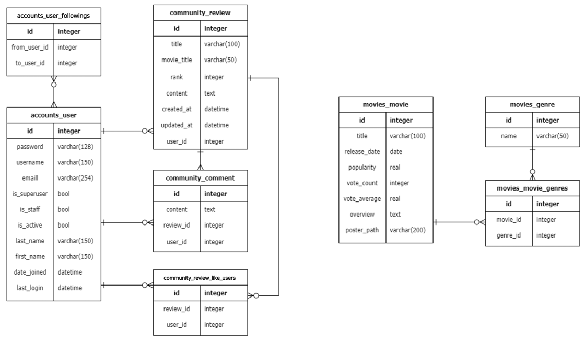

# 

## 1. 개요
- AJAX와 JSON 데이터를 활용하는 커뮤니티 웹 서비스의 구성
- 장르 별 영화데이터 조회가 가능한 애플리케이션 완성
- 영화 리뷰의 좋아요가 가능한 애플리케이션 완성
- 유저 간 팔로우가 가능한 애플리케이션 완성
- 알고리즘을 통한 영화 추천이 가능한 애플리케이션 완성

## 2. 요약
- 프로젝트 이름 : mypjt
- 앱이름
  - movies
  - accounts
  - community
- 기능
  - 유저 팔로우 기능
    - accounts 앱의 follow view 함수 활용
    - 프로필 페이지 (accounts/profile.html) 활용
    - 해당 사용자를 팔로우할 수 있는 버튼, 팔로워 수와 팔로잉 수를 표시
    - 인증된 사용자만 다른 사용자를 팔로우할 수 있으며 사용자는 자기 자신을 팔로우할 수 없음
    - 팔로우 버튼을 클릭하는 경우, AJAX기술을 이용하여 새로고침 없이 프로필 페이지 화면을 구성 (팔로우버튼 토글, 팔로워/팔로잉 수)

  - 리뷰 좋아요 기능
    -  community 앱의 like view 함수를 활용
    -  전체 리뷰 목록 조회 페이지(community/index.html) 활용
    -  좋아요 버튼과 좋아요 개수를 표시
    -  인증된 사용자만 좋아요를 진행 할 수 있음
    -  좋아요 버튼을 클릭하는 경우, AJAX 기술을 이용하여 새로고침 없이 프로필 페이지화면을 구성 (좋아요 버튼 토글, 좋아요 수)

  - 영화 장르 필터링
    -  movies 앱의 filter_genre view 함수를 활용
    -  전체 영화 목록 조회 페이지(movies/index.html) 활용
    -  선택한 장르에 맞는 영화 데이터 목록 필터링 후 출력
       -  장르와 영화는 제공된 fixtures 활용
    -  페이지 첫 접속 시에는 전체 영화를 출력
    -  사용자의 인증 여부와 관계없음
    -  장르를 선택하는 경우, AJAX 기술을 이용하여 새로고침 없이 영화 목록 조회 페이지화면을 재구성
 
 - ERD 
     

## 3. 앱 별 URL 및 view함수
### 1) movies
  | **URL**                   | **역할**                        | **HTTP Method** | **View 함수명**   |
  |---------------------------|--------------------------------|-----------------|------------------|
  | `/movies/`                | 전체 영화 목록 페이지 조회        | `GET`           | `index`          |
  | `/movies/filter-genre/`   | 필터링된 영화 데이터 제공         | `GET`           | `filter_genre`   |
  | `/movies/recommended/`    | 영화 추천 페이지 조회             | `GET`           | `recommended`    |
### 2) accounts
  | **URL**                        | **역할**                                           | **HTTP Method** | **View 함수명** |
  |--------------------------------|----------------------------------------------------|-----------------|-----------------|
  | `/accounts/signup/`            | 회원 생성 페이지 조회 및 단일 회원 데이터 생성        | `GET & POST`    | `signup`        |
  | `/accounts/login/`             | 로그인 페이지 조회 및 세션 데이터 생성 및 저장        | `GET & POST`    | `login`         |
  | `/accounts/logout/`            | 현재 사용자의 세션 데이터 삭제                       | `POST`          | `logout`        |
  | `/accounts/profile/<username>/`| 사용자 상세 조회 페이지 (프로필 조회)                | `GET`           | `profile`       |
  | `/accounts/<user_pk>/follow/`  | 사용자 팔로우 기능                                  | `POST`          |    |
### 3) community
  | **URL**                                     | **역할**                             | **HTTP Method** | **View 함수명**     |
  |---------------------------------------------|--------------------------------------|-----------------|---------------------|
  | `/community/`                               | 전체 리뷰 목록 페이지 조회             | `GET`           | `index`             |
  | `/community/create/`                        | 새로운 리뷰 생성 페이지 조회 및 데이터 저장 | `GET & POST`    | `create`            |
  | `/community/<review_pk>/`                   | 단일 리뷰 상세 페이지 조회             | `GET`           | `detail`            |
  | `/community/<review_pk>/comments/create/`   | 단일 댓글 데이터 저장                 | `POST`          | `create_comment`    |
  | `/community/<review_pk>/like/`              | 단일 리뷰 좋아요 기능                 | `POST`          |    |

## 4. 서버 실행 전 준비
- `python manage.py migrate`
- `python manage.py loaddata movies/movies.json`